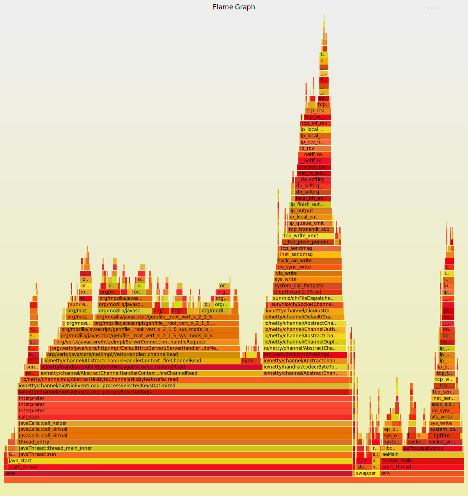

[](https://crates.io/crates/inferno)
[](https://docs.rs/inferno/)
[](https://travis-ci.com/jonhoo/inferno)
[](https://codecov.io/gh/jonhoo/inferno)
[](https://deps.rs/repo/github/jonhoo/inferno)

Inferno is a port of parts of the [flamegraph
toolkit](http://www.brendangregg.com/flamegraphs.html) to Rust, with the
aim of improving the performance of the original flamegraph tools. The
primary focus is on speeding up the `stackcollapse-*` tools that process
output from various profiling tools into the "folded" format expected by
the `flamegraph` plotting tool. So far, the focus has been on parsing
profiling results from
[`perf`](https://perf.wiki.kernel.org/index.php/Main_Page) and
[DTrace](https://www.joyent.com/dtrace). At the time of writing,
`inferno-collapse-perf` is ~9x faster than `stackcollapse-perf.pl` and
`inferno-collapse-dtrace` is ~10x faster than `stackcollapse.pl` (see
`compare.sh`).

It is developed in part through live coding sessions, which you can find
[on YouTube](https://www.youtube.com/watch?v=jTpK-bNZiA4&list=PLqbS7AVVErFimAvMW-kIJUwxpPvcPBCsz).

## Using Inferno

### As a library

Inferno provides a [library interface](https://docs.rs/inferno/) through
the `inferno` crate. This will let you collapse stacks and produce flame
graphs without going through the command line, and is intended for
integration with external Rust tools like [`cargo-flamegraph`].

  [`cargo-flamegraph`]: https://github.com/ferrous-systems/cargo-flamegraph

### As a binary

First of all, you may want to look into [cargo
flamegraph](https://github.com/ferrous-systems/cargo-flamegraph/), which
deals with much of the infrastructure for you!

If you want to use Inferno directly, then build your application in
release mode and with debug symbols, and then [run a profiler] to gather
profiling data. Once you have the data, pass it through the appropriate
Inferno "collapser". Depending on your platform, this will look
something like

  [run a profiler]: http://www.brendangregg.com/FlameGraphs/cpuflamegraphs.html#Instructions

```console
$ # Linux
# perf record --call-graph dwarf target/release/mybin
$ perf script | inferno-collapse-perf > stacks.folded
```

or

```console
$ # macOS
$ target/release/mybin &
$ pid=$!
# dtrace -x ustackframes=100 -n "profile-97 /pid == $pid/ { @[ustack()] = count(); } tick-60s { exit(0); }"  -o out.user_stacks
$ cat out.user_stacks | inferno-collapse-dtrace > stacks.folded
```

You can also use `inferno-collapse-guess` which should work on both
perf and DTrace samples. In the end, you'll end up with a "folded stack"
file. You can pass that file to `inferno-flamegraph` to generate a flame
graph SVG:

```console
$ cat stacks.folded | inferno-flamegraph > flamegraph.svg
```

You'll end up with an image like this:

[](tests/data/flamegraph/example-perf-stacks/example-perf-stacks.svg)

### Obtaining profiling data

To profile your application, you'll need to have a "profiler" installed.
This will likely be [`perf`]() or [`bpftrace`] on Linux, and [DTrace] on
macOS. There are some great instructions on how to get started with
these tools on Brendan Gregg's [CPU Flame Graphs page].

  [profiler]: https://en.wikipedia.org/wiki/Profiling_(computer_programming
  [`perf`]: https://perf.wiki.kernel.org/index.php/Main_Page
  [`bpftrace`]: https://github.com/iovisor/bpftrace/
  [DTrace]: https://www.joyent.com/dtrace
  [CPU Flame Graphs page]: http://www.brendangregg.com/FlameGraphs/cpuflamegraphs.html#Instructions

On Linux, you may need to tweak a kernel config such as
```console
$ echo 0 | sudo tee /proc/sys/kernel/perf_event_paranoid
```
to get profiling [to work](https://unix.stackexchange.com/a/14256).

## Performance

### Comparison to the Perl implementation

To run Inferno's performance comparison, run `./compare.sh`.
It requires [hyperfine](https://github.com/sharkdp/hyperfine), and you
must make sure you also check out Inferno's
[submodules](https://github.blog/2016-02-01-working-with-submodules/).

### Collapsing benchmarks

Inferno includes [criterion](https://github.com/bheisler/criterion.rs)
benchmarks of its stack collapser implementations in [`benches/`](benches/).
Criterion saves its results in `target/criterion/`, and uses that to
recognize changes in performance, which should make it easy to detect
performance regressions while developing bugfixes and improvements.

You can run the benchmarks with `cargo bench`. Some results (YMMV):

My desktop computer (AMD Ryzen 5 2600X) gets:

```
collapse/perf           time:   [14.978 ms 14.987 ms 14.996 ms]
                        thrpt:  [199.64 MiB/s 199.76 MiB/s 199.88 MiB/s]

collapse/dtrace         time:   [9.8128 ms 9.8169 ms 9.8213 ms]
                        thrpt:  [134.24 MiB/s 134.30 MiB/s 134.36 MiB/s]
```

My laptop (Intel Core i7-8650U) get:

```
collapse/perf           time:   [13.548 ms 13.573 ms 13.603 ms]
                        thrpt:  [220.07 MiB/s 220.56 MiB/s 220.97 MiB/s]

collapse/dtrace         time:   [9.1285 ms 9.1403 ms 9.1534 ms]
                        thrpt:  [144.04 MiB/s 144.24 MiB/s 144.43 MiB/s]
```

## License

Inferno is a port of @brendangregg's awesome original
[FlameGraph](https://github.com/brendangregg/FlameGraph) project,
written in Perl, and owes its existence and pretty much of all of its
functionality entirely to that project. [Like
FlameGraph](https://github.com/brendangregg/FlameGraph/commit/76719a446d6091c88434489cc99d6355c3c3ef41),
Inferno is licensed under the [CDDL
1.0](https://opensource.org/licenses/CDDL-1.0) to avoid any licensing
issues. Specifically, the CDDL 1.0 grants

> a world-wide, royalty-free, non-exclusive license under intellectual
> property rights (other than patent or trademark) Licensable by Initial
> Developer, to use, reproduce, modify, display, perform, sublicense and
> distribute the Original Software (or portions thereof), with or
> without Modifications, and/or as part of a Larger Work; and under
> Patent Claims infringed by the making, using or selling of Original
> Software, to make, have made, use, practice, sell, and offer for sale,
> and/or otherwise dispose of the Original Software (or portions
> thereof).

as long as the source is made available along with the license (3.1),
both of which are true since you're reading this file!
